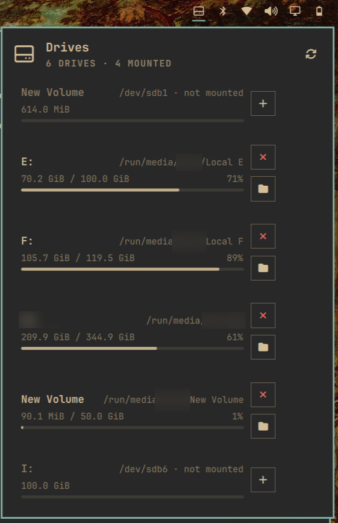

# Drives

An Omarchy bar widget for managing drives — mount, unmount, eject, and open removable storage from the panel.

## Features

- Lists all labeled/mounted drives (skips system partitions like root, boot, swap, zram)
- **Click any drive row**:
  - Mounted → opens in the file manager
  - Unmounted → mounts (password prompt if needed) **and opens automatically** — no second click
- **Press `t` on any drive**:
  - Mounted → opens terminal at the mountpoint
  - Unmounted → mounts (password prompt if needed) **then opens terminal at the mountpoint**
- **Search mode**: press `/` to activate search, type to filter drives live by label, display name, device, or mountpoint (e.g. `f:` for `Local F:` / `F:`)
- **Keyboard navigation** (key mode, press Esc to enter):
  - ↑/↓ — navigate list
  - Enter — open highlighted drive (mounts first if needed)
  - `t` — open in terminal (mounts first if unmounted)
  - `m` — mount selected drive
  - `u` — unmount selected drive
  - `e` — eject selected drive (power-off removable drives)
  - `p` — pin/unpin drive to top of list
  - `/` — enter search mode
  - Esc — exit search mode or close popup
- **Top result always highlighted**: on popup open and as search results change; theme-aware accent colors for selection
- **Eject vs Unmount distinction**:
  - USB/external drives show ⏏ (eject) button → powers off the entire drive after unmount
  - Internal drives show × (unmount) button → unmounts filesystem only
- Right-click the bar icon to rescan, middle-click to open first mounted drive
- Live updates on plug/unplug via udev
- Usage bars with percentages (urgent color at ≥90%)
- Configurable refresh interval (default 5s, set via `shell.json`)
- Pin drives to top of list with `p` shortcut

## Installation

```bash
# Download and verify release tarball (immutable, integrity-checked)
wget https://github.com/arsinghin/drives/releases/download/v1.2.0/drives.tar.gz
echo "34e448cb180f1778d13039491fc9f942b5f811c790f2b3d547a9172da8fa5056  drives.tar.gz" | sha256sum -c - && tar -xzf drives.tar.gz -C ~/.config/omarchy/plugins/
omarchy restart shell
```

## Removal

```bash
rm -rf ~/.config/omarchy/plugins/drives
omarchy restart shell
```

## Screenshot



## Configuration

Optional: set refresh interval in `~/.config/omarchy/shell.json`:

```json
"drives": {
  "refreshSeconds": 5
}
```

## Author

AR Singh